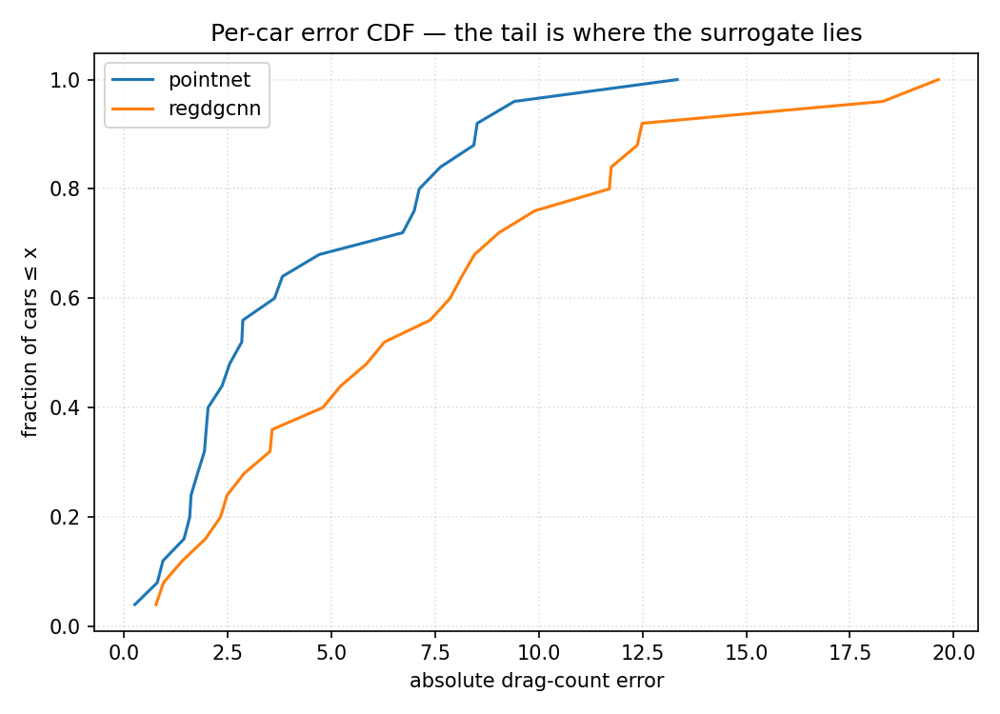

# 🏎️💨 CFD‑AI Surrogate Bench — Automotive Aerodynamics

<p align="center">
  
  
  
  
</p>
<p align="center">
  
  
  
  
  
  
  
</p>

> 🧪 **CFD** ground truth · ⚙️ **HPC**‑scale cost · 🤖 **AI** surrogates · 🏁 community **leaderboard**

**An open, reproducible benchmark for neural‑network surrogates of automotive CFD.**
Same dataset, same hardware — the *model architecture is the only variable*. We report the honest
**speed / accuracy / cost / failure** picture, ship a portable harness so you can run it on your own
geometry, and host a leaderboard you can submit to.

> Built on **DrivAerML** (high‑fidelity hybrid RANS‑LES of 500 DrivAer cars, CC‑BY‑SA). Runs on a
> single GPU. The intersection of **HPC + AI + automotive**.

---

## 1. The one‑paragraph pitch

Every car company spends enormous compute predicting one number — **aerodynamic drag (Cd)** — with
CFD. A single high‑fidelity solve in this dataset costs **~61,440 CPU core‑hours** (160‑million‑cell
mesh, 1,536 cores × ~40 h). Neural surrogates promise the same number in **milliseconds**. This
benchmark asks the questions a real aero/HPC engineer actually has — *how many simulations do you
need to train one? Does it generalize or just interpolate? What does it cost in energy? Can you
recover drag from a predicted pressure field?* — and answers them with pre‑registered methodology,
high‑fidelity (LES) ground truth, and **the failures reported as loudly as the wins.**

## 2. Why this matters (and who it helps)

| Audience | What they get |
|---|---|
| **CFD / aero engineers** | An honest accuracy envelope **in drag counts** (the unit you actually decide on), validated against LES — plus exactly where the surrogate stops being physics and starts being interpolation. |
| **HPC / infra** | Energy (J/inference) and end‑to‑end cost vs the solver on the same hardware; a finding that these surrogates are **data‑pipeline‑bound, not GPU‑bound**. |
| **ML researchers** | A fair architecture panel at matched compute, a clean **data‑efficiency scaling law**, OOD/novelty analysis, and a released harness + leaderboard. |
| **Decision‑makers** | A defensible answer to "can AI cut our CFD bill?" — *yes, for early screening; no, for certification* — with numbers. |

## 3. Headline results (DrivAerML, single GPU, 197 train / 25 test)

| Surrogate | Cd MAE (drag‑counts) ↓ | R² ↑ | latency (ms/car) | energy (J/car) | params |
|---|---:|---:|---:|---:|---:|
| **PointNet** | **4.21** | **0.881** | **0.65** | **0.21** | 1.0 M |
| RegDGCNN (paper baseline) | 7.16 | 0.683 | 4.67 | 2.63 | 1.8 M |

*1 drag‑count = 0.001 Cd. DrivAer Cd ≈ 0.25–0.30, so 4.2 counts ≈ 1.5% error.*

### 3.1 The cheap model won — speed vs accuracy

On a few‑hundred‑car dataset, plain **PointNet beat the heavier dynamic‑graph CNN** on accuracy
*and* ran 7× faster at ~12× lower energy. The fancy architecture's extra machinery hurt in the
small‑data regime — a result worth arguing about, which is the point.


### 3.2 How many CFD runs do you actually need? — the data‑efficiency law

RegDGCNN's error falls **12.4 → 11.5 → 9.9 → 8.9 → 7.2 counts** as training data grows
**20 → 49 → 98 → 148 → 197** cars (R² −0.01 → 0.68) — and it is **still descending at 197**. At this
scale you are **data‑bound, not model‑bound**: more CFD still pays. This curve is the single most
useful artifact for anyone budgeting a simulation campaign.

### 3.3 Physics or interpolation? — the generalization cliff

Per‑car drag error correlates with **geometric novelty** (distance to the nearest training shape),
corr **r = 0.37**; the most novel half of the test set is **1.3× worse** (4.8 vs 3.6 counts). The
worst‑10 gallery (below) is dominated by unusual shapes. **The surrogate learned the dataset's
shape‑manifold, not the Navier‑Stokes equations** — it is a *screening* tool, trustworthy near what
it has seen.


### 3.4 Error distribution


### 3.5 A negative result we're proud of — field → drag by integration
We also trained a per‑point **surface‑pressure (Cp)** model and tried to **recover drag by
integrating the predicted field**. The field model learns (rel‑L2 0.97 → ~0.55), but **integration
does not recover Cd** — even integrating the *ground‑truth* Cp field misses by **~530 counts**.
Causes: the surface mesh isn't watertight (so ∮ area·normal doesn't cancel), pressure‑coefficient
convention, and pressure‑only integration ignores friction drag. **Lesson: for drag, regress the
scalar directly; use the field for visualization/diagnostics, not force recovery.**

### 3.6 The HPC angle
One DrivAerML HRLES solve ≈ **61,440 CPU core‑hours** (160 M cells, 1,536 cores × ~40 h); the full
500‑case dataset ≈ **30.7 M core‑hours**. Surrogate inference is **0.65 ms / 0.21 J**. Once trained,
each new shape is screened **~10⁸× cheaper in compute** (amortized). Notably, the surrogate training
**never exceeded ~0% GPU utilisation** on a B200 — the bottleneck is the 660 MB‑per‑car mesh I/O,
**not** GPU compute, so a modest GPU + parallel preprocessing is the right hardware here.

## 4. How it works

```
STL / surface mesh ──▶ sample N surface points (or cells)
        │                    │
        │              normalize to unit sphere
        ▼                    ▼
   geometry ──▶  surrogate (PointNet | RegDGCNN | PointNet‑Cp)  ──▶  Cd  (Task A: scalar)
                                                              └──▶  Cp field (Task B) ─▶ integrate ─▶ Cd
        ▲                                                                                    ▲
   ground truth: DrivAerML CFD (force_mom_*.csv for Cd, boundary_*.vtp for the pressure field)
```

- **Task A — scalar drag.** Predict Cd from the geometry point cloud. Metric: drag‑count MAE, R².
- **Task B — surface‑pressure field.** Predict per‑point Cp; integrate over the true mesh to recover Cd.
- **The variable is the architecture.** Same data, same splits, matched training budget.
- **Surrogates:** `PointNet` (global‑pool MLP), `RegDGCNN` (dynamic‑graph EdgeConv, the DrivAerNet
  paper baseline), `PointNet‑Cp` (per‑point field head). NVIDIA **DoMINO** (PhysicsNeMo) is wired for
  a future pass.

See [`docs/METHODOLOGY.md`](docs/METHODOLOGY.md) for the pre‑registered protocol and
[`docs/DESIGN.md`](docs/DESIGN.md) for the full multi‑axis benchmark design.

## 5. Reproduce it

```bash
pip install -r requirements.txt

# 1. Data (HTTPS, no Globus): geometry + Cd labels for N cars
HF_TOKEN=hf_xxx python3 data/get_drivaerml.py --n-runs 250

# 2. Scalar‑Cd bake‑off
python3 run_bench.py --surrogate pointnet  --task cd
python3 run_bench.py --surrogate regdgcnn  --task cd

# 3. Data‑efficiency scaling law (vary the training fraction)
for f in 0.1 0.25 0.5 0.75 1.0; do python3 run_bench.py --surrogate regdgcnn --task cd --train-frac $f; done

# 4. Plots + geometric‑novelty cliff
python3 make_plots.py        # → results/plots/fig1..fig5
python3 novelty.py           # → results/plots/fig7 + results/novelty.json

# 5. Surface‑pressure field (Task B)
HF_TOKEN=hf_xxx python3 data/get_fields.py --n-runs 120
python3 run_field.py
```
Each run writes a self‑describing JSON to `results/`; the harness is geometry‑/GPU‑/model‑agnostic.

## 6. Repo layout
```
data/        dataset loaders + HTTPS downloaders (DrivAerML / DrivAerNet++ / fields)
surrogates/  pointnet, regdgcnn, pointnet_field  (+ DoMINO planned)
run_bench.py scalar‑Cd training/eval → run‑record JSON (drag counts, R², latency, NVML energy)
run_field.py surface‑pressure field training + exact drag‑by‑integration
make_plots.py / novelty.py   publication plots
configs/     dataset + surrogate hyperparameters
results/     run‑records (JSON) + plots + novelty.json   ← the numbers above are reproducible from here
docs/        METHODOLOGY (pre‑registered) · DESIGN · NEWSLETTER write‑up
ops/         NVIDIA Brev provisioning + sync scripts used to produce these results
LEADERBOARD.md   submit your surrogate via a PR
```

## 7. Leaderboard
See [`LEADERBOARD.md`](LEADERBOARD.md). Run the harness, get a `results/run_*.json`, open a PR with
that file + your row — CI validates the schema and recomputes the metric.

## 8. Scope & honesty
- Steady/averaged **DrivAer passenger‑car** aero. Surrogates **screen** designs; they do **not**
  certify. "Faster" ≠ "correct" — the accuracy envelope, scaling curve, and novelty cliff are the point.
- DrivAerML is single body type (notchback); the **body‑type cliff** (fastback→estate) and
  **RANS→LES cross‑fidelity** need the multi‑body **DrivAerNet++** set (Globus) and are the next edition.
- We did **not** run OpenFOAM ourselves; the 61,440‑core‑hour anchor is the dataset's *published* cost.

## 9. Data & citations
- **DrivAerML** — Ashton et al., 2024, *arXiv:2408.11969*, CC‑BY‑SA, [caemldatasets.org](https://caemldatasets.org/drivaerml/).
- **DrivAerNet++** — Elrefaie et al., 2024, *arXiv:2406.09624*, CC‑BY‑NC.
- RegDGCNN baseline from the DrivAerNet paper; PhysicsNeMo / DoMINO by NVIDIA.

## 10. License
Code: **MIT**. Results & figures: **CC‑BY‑4.0**. Datasets retain their own licenses (above).
Built by **Deep Soni / AI CoE** — part of the *Beyond the Model* benchmark series.
