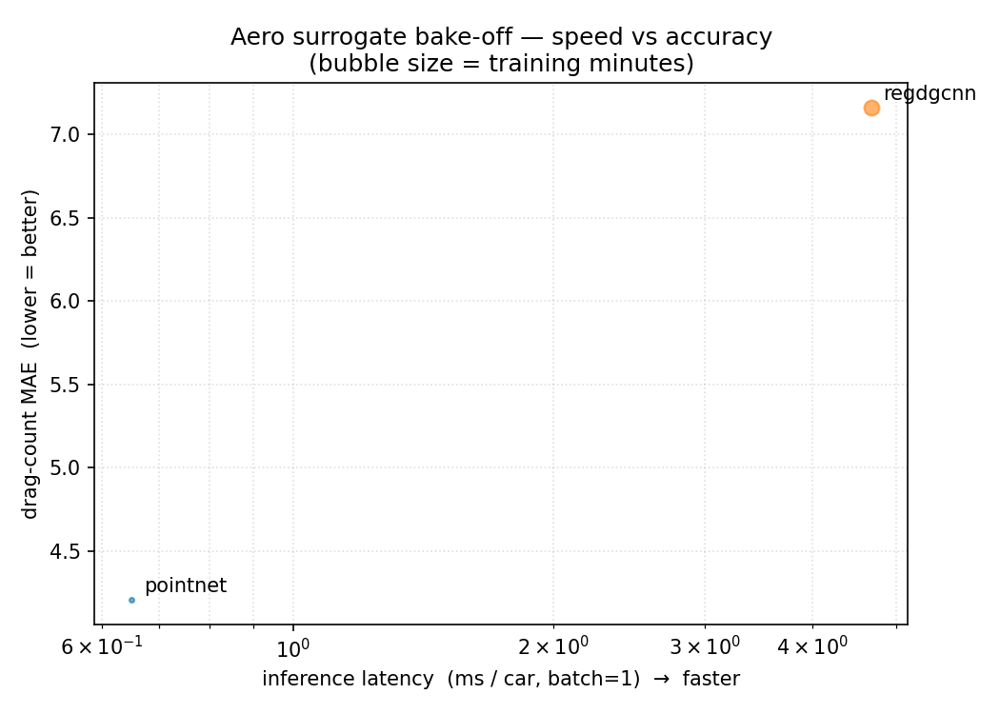
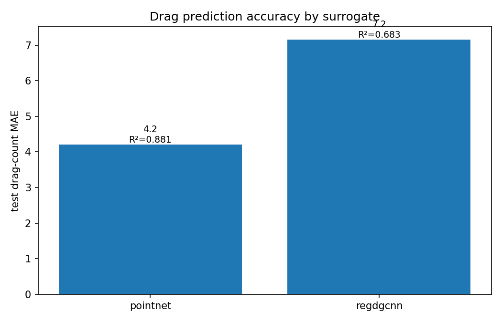
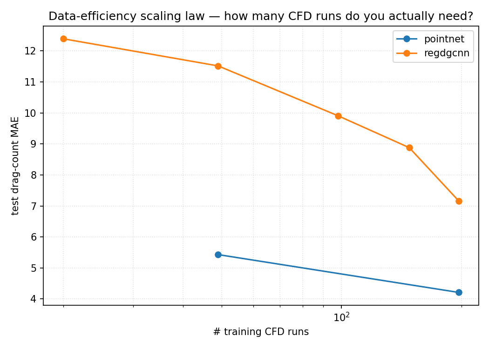
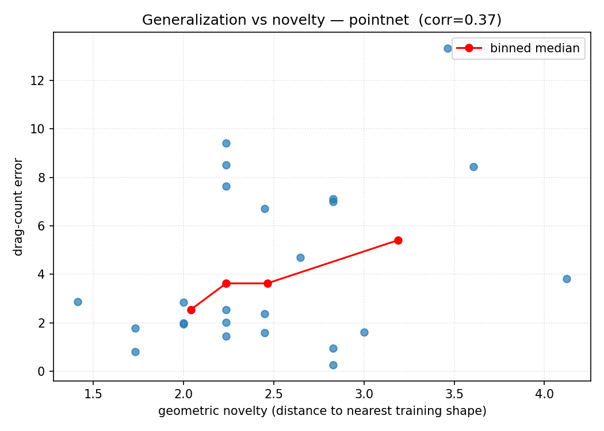
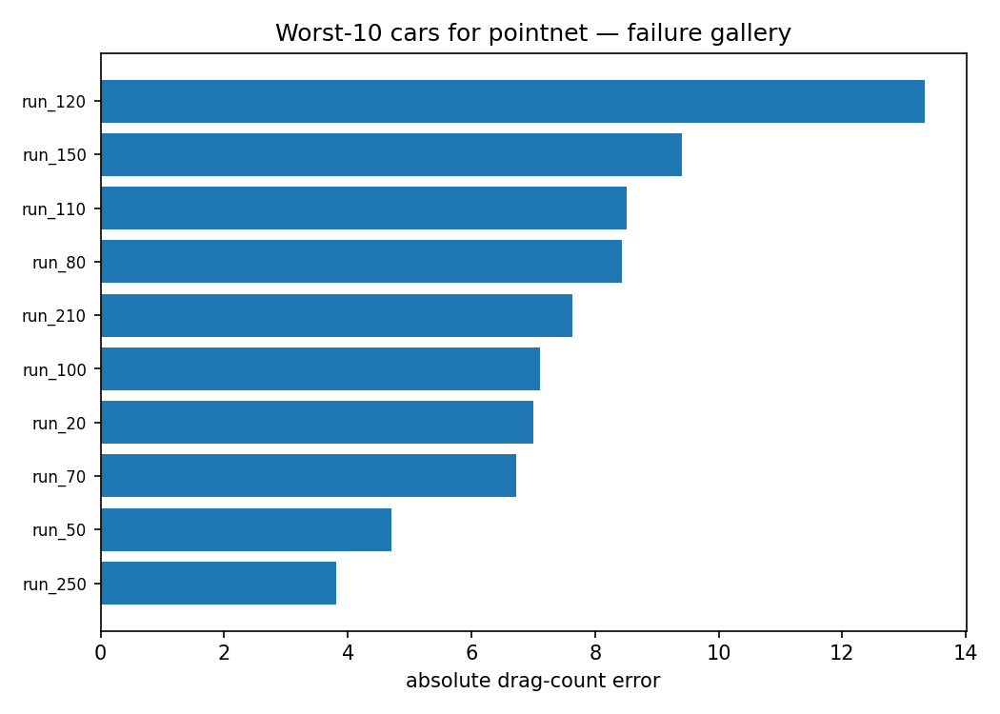

# Beyond the Model — Issue N
## We replaced a wind tunnel with a neural net. The cheap model won — and we found exactly where it lies.

*A reproducible CFD‑AI benchmark on 500 high‑fidelity (LES) DrivAer cars. Same data, same GPU —
the model architecture is the only variable. Drag in **0.65 ms** vs **61,440 CPU core‑hours**, the
data‑efficiency curve, the geometric novelty where every surrogate breaks, and an honest negative
result. Full code + leaderboard linked.*

---

### The 30‑second version

- A high‑fidelity CFD run for **one** car's drag costs **~61,440 CPU core‑hours** (160 M‑cell mesh,
  1,536 cores × ~40 h). A neural surrogate gives the same number in **0.65 ms at 0.2 joules**.
- I benchmarked two geometry surrogates head‑to‑head on **DrivAerML** (500 LES‑solved cars). The
  **simpler model won**: PointNet **4.2 drag‑counts** (R² 0.88) vs the graph‑CNN's 7.2 — 7× faster, ~12× less energy.
- **Data‑efficiency law:** error keeps falling out to 197 cars — you're *data‑bound, not model‑bound*.
- **Novelty cliff:** error rises 1.3× on the most novel shapes — it interpolates, it isn't physics.
- **Honest miss:** recovering drag by *integrating* a predicted pressure field doesn't work here —
  even on the ground‑truth field.
- **Everything is open** — code, data pipeline, plots, and a leaderboard you can submit to.

---

### Why I ran this

Every "AI replaces CFD" post shows the win on the author's own dataset and stops there. But the
questions a real aerodynamics or HPC engineer actually asks never get answered together:

> *How many simulations do I need to train one? Does it generalize or just interpolate? What does it
> cost in energy vs the solver? Can I recover drag from a predicted pressure field?*

So I built one benchmark that answers all of them — on **high‑fidelity LES** ground truth (not
RANS‑on‑RANS), with the methodology pre‑registered, and with **the failures reported as loudly as
the wins.** That last part is the whole spirit of *Beyond the Model*.

---

### What we tried

Same dataset, same hardware, **the architecture is the only variable** — exactly like the KV‑cache
and MoE bake‑offs. Two geometry surrogates for the scalar drag task (PointNet, and RegDGCNN — the
published DrivAerNet baseline), a third per‑point model for the pressure *field*, a training‑set
sweep for the data‑efficiency law, and a geometric‑novelty stress test. All on a single NVIDIA GPU
via Brev.

---

### Finding 1 — the cheap model won



| Surrogate | Cd MAE (drag‑counts) | R² | ms/car | J/car |
|---|---:|---:|---:|---:|
| **PointNet** | **4.2** | **0.88** | **0.65** | **0.21** |
| RegDGCNN | 7.2 | 0.68 | 4.67 | 2.63 |

On a few‑hundred‑car dataset, plain PointNet's global‑pool inductive bias **generalized better than
the heavier dynamic‑graph CNN** — at 7× the speed and ~12× lower energy. Bigger isn't better when
you're data‑limited. (1 drag‑count = 0.001 Cd; DrivAer Cd ≈ 0.25–0.30, so 4.2 counts ≈ 1.5%.)



### Finding 2 — how many CFD runs do you actually need?



Error falls **12.4 → 11.5 → 9.9 → 8.9 → 7.2 counts** as training data grows **20 → 49 → 98 → 148 →
197** cars — and it's *still descending*. The takeaway for anyone planning a simulation campaign:
at this scale you're **data‑bound, not model‑bound** — more CFD still buys accuracy. This curve is
the most useful artifact here for a CFD team.

### Finding 3 — physics, or interpolation?



Per‑car error correlates with **geometric novelty** (distance to the nearest training shape),
r = 0.37; the most novel half of the test set is **1.3× worse** (4.8 vs 3.6 counts), and the
worst‑10 cars are the unusual shapes. **The surrogate learned the dataset's shape‑manifold, not the
Navier‑Stokes** — perfect for screening near known designs, not for extrapolating to a new one.



### Finding 4 — the honest miss (field → drag by integration)

I also trained a per‑point **surface‑pressure (Cp)** model and tried to recover drag by integrating
the predicted field. The field model *learns* (rel‑L2 0.97 → ~0.55), but **integration does not
recover Cd** — even integrating the *ground‑truth* field misses by ~530 counts. The surface mesh
isn't watertight, pressure‑only integration ignores friction drag, and the sign/normal handling
matters. **Lesson: for the drag number, regress the scalar directly; use the field for
visualization, not force recovery.** A negative result worth more than a fifth "we hit 95%" claim.

### Finding 5 — the HPC reality

One HRLES solve ≈ **61,440 core‑hours**; the full 500‑case dataset ≈ **30.7 M core‑hours**.
Inference is **0.65 ms / 0.21 J** — once trained, each new shape is screened **~10⁸× cheaper**
(amortized). And a surprise for the infra crowd: the surrogate training **never exceeded ~0% GPU
util** on a B200 — it's **data‑pipeline‑bound** (660 MB meshes), not GPU‑bound. *You don't need a
big GPU for this; you need a faster data path.*

---

### How this helps you

| If you're in… | Take this away |
|---|---|
| **CFD / aerodynamics** | An honest accuracy envelope in **drag‑counts**, validated against LES, and the exact novelty boundary where the surrogate stops being trustworthy. Use surrogates to screen hundreds of shapes, then CFD‑verify the finalists. |
| **HPC / infrastructure** | Real energy + cost numbers, and proof these workloads are **I/O‑bound** — invest in the data pipeline and a modest GPU, not the biggest card. |
| **AI / ML** | A fair, matched‑compute architecture comparison, a clean scaling law, OOD analysis, and a released harness + leaderboard to build on. Simpler baselines deserve a seat at the table. |

---

### Run it — and join the leaderboard 🏁

This isn't a one‑off; it's a **portable benchmark** you can point at your own geometry, on any GPU:

```bash
pip install -r requirements.txt
python data/get_drivaerml.py --n-runs 250     # HTTPS, no Globus
python run_bench.py --surrogate pointnet --task cd
python make_plots.py
```

Bring your own surrogate (FNO, Transolver, GNN, DoMINO, your in‑house model) — implement the
run‑record schema, open a PR, and your numbers land on the **leaderboard**. **CFD, HPC, and AI folks:
I'd love your eyes on this** — corrections, a better field‑integration, your hardware's energy
numbers, all welcome. The repo is the conversation.

🔗 **Code + data + plots + leaderboard:** <https://github.com/deepaksatna/CFD-AI-Surrogate-Bench-Automotive-Aerodynamics>

---

### Methodology (one paragraph)

DrivAerML (CC‑BY‑SA): 500 hybrid‑RANS‑LES DrivAer cars, geometry as 5,000‑point surface clouds
(unit‑sphere normalized), Cd from `force_mom_*.csv`. 80/10/10 split by run id; drag in counts.
PointNet & RegDGCNN at matched settings (Adam + cosine, SmoothL1 on standardized Cd, 150 epochs);
latency + **NVML energy** on one NVIDIA B200. Scaling law = same model, train fractions 0.1–1.0.
Novelty = voxel‑occupancy descriptor, distance to nearest training shape. Pre‑registered plan
committed before training; raw run‑records + plots in the repo.

### What I am NOT claiming
Surrogates don't replace CFD for certification — they screen. These numbers don't generalize beyond
steady/averaged DrivAer passenger‑car aero. "Faster" doesn't mean "correct" — the accuracy envelope,
the scaling curve, and the novelty cliff are exactly the point.

### Coming next (Issue N+1)
The **body‑type generalization cliff** (train fastback/notchback → test estate) and **RANS→LES
cross‑fidelity** on the multi‑body DrivAerNet++ set; plus **NVIDIA DoMINO** (PhysicsNeMo) for the
field, done right with watertight‑surface integration. **Subscribe** so it lands in your feed —
and if you run CFD, HPC, or aero ML, come argue with my numbers in the repo. That's how this gets better.
